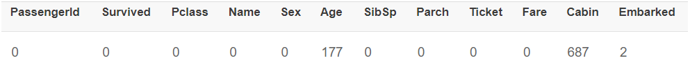
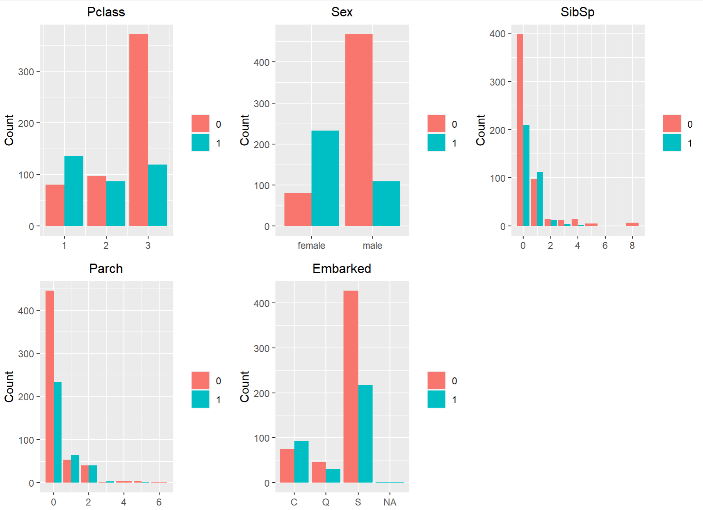
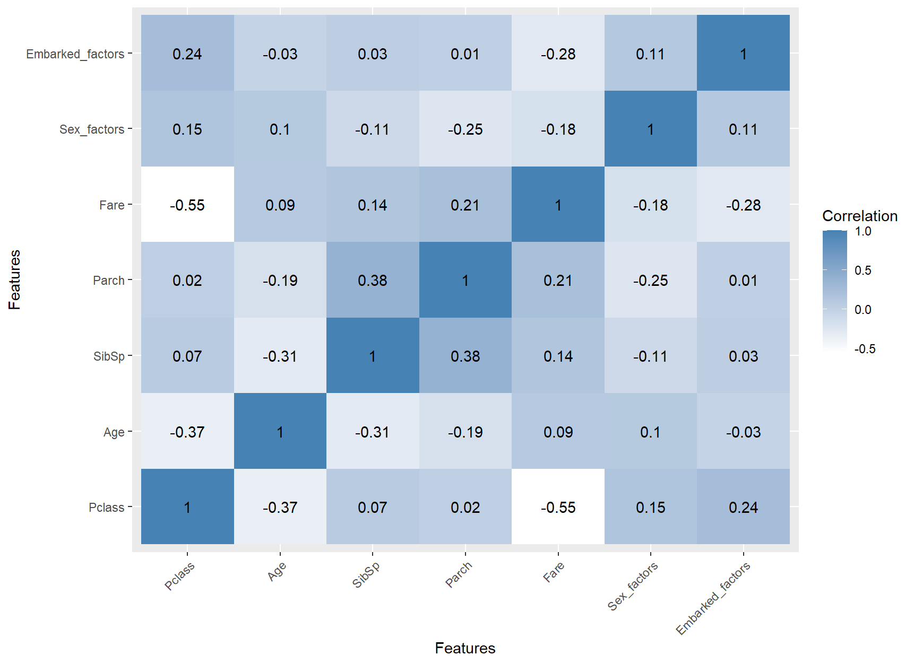
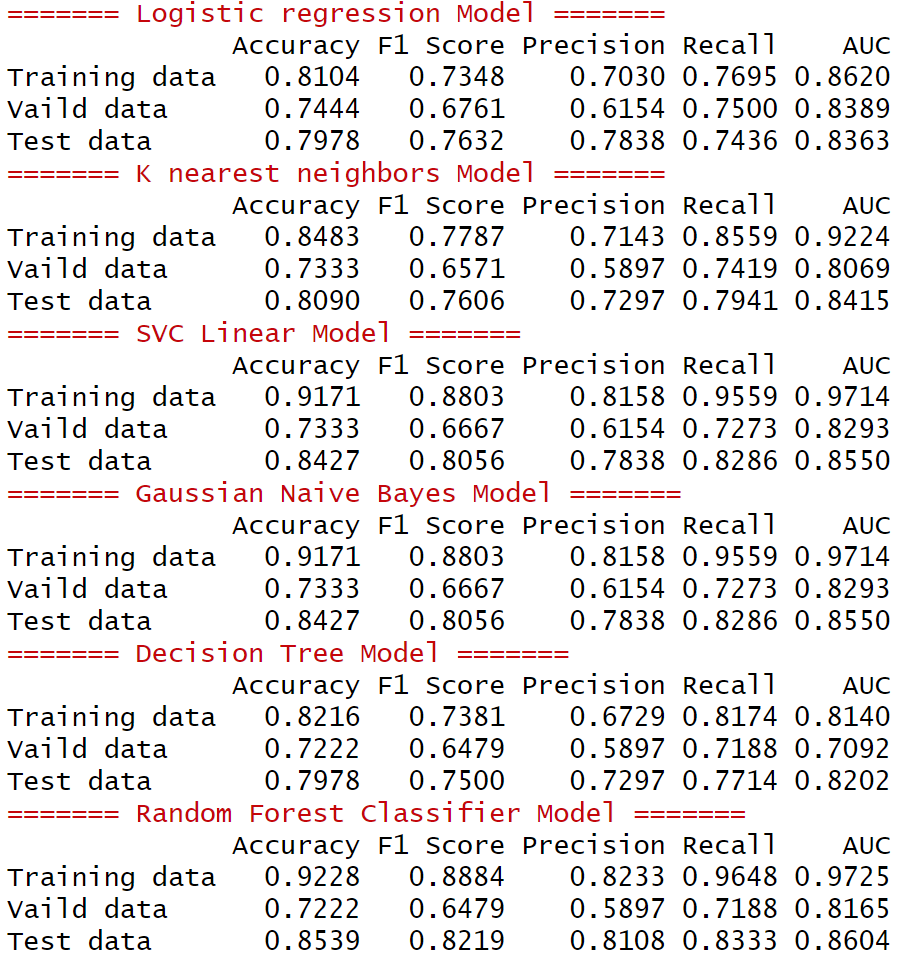

# [Group 1] TITANIC 生存率預測

鐵達尼號（Titanic）是一艘英國的豪華郵輪，於 1912 年 4 月 10 日從英國南安普頓啟航前往美國紐約。它被認為是當時世界上最大、最先進的郵輪之一，長約 269 米，重達 4 萬多噸，並且擁有當時最先進的船舶技術，包括電力驅動的升降梯、無線電和螺旋槳等。

然而，這場豪華之旅很快便結束了。在鐵達尼號於 4 月 14 日深夜航行至北大西洋時，船撞上了一個冰山，造成船身嚴重受損，最終導致鐵達尼號沉沒。船上共有 2224 人，其中包括乘客和船員，但只有 710 人幸存下來。

我們將探究什麼樣的人在此次海難中倖存的幾率更高，並通過構建預測模型來預測乘客生存率。

## Contributors

| 組員   | 系級     | 學號      | 工作分配                                                  |
| ------ | -------- | --------- | --------------------------------------------------------- |
| 陳湘婷 | 資科專一 | 111971006 | EDA 及 Features 與 target 相關性、DEMO 程式撰寫           |
| 程品潔 | 資科專一 | 111971008 | EDA 的相關係數 heatmap 圖、建立模組及模組 DEMO 的程式撰寫 |
| 李姿瑩 | 資科專一 | 111971018 | 建立模組及生存預測 DEMO 的程式撰寫                        |
| 黃哲偉 | 資科專一 | 111971030 | 特徵擷取的程式撰寫、程式整合及期末報告的網頁製作          |
| 許廷瑋 | 資科專一 | 111971021 | 文件整合、Readme 撰寫以及負責上台報告                     |
| 林秉謙 | 資科專二 | 110971017 | 建立模組及生存預測 DEMO 的程式撰寫                        |

## Quick start

在final-project-group1目錄下執行以下指令，結果產生在results目錄下

```R
Rscript code/model.R
```

## Documents

- 以網頁的方式展示: [TITANIC 生存率預測](https://2xwj18ogag8bs8k2in05pq.on.drv.tw/NCCU/111%E5%AD%B8%E5%B9%B4%E5%BA%A6/%E4%B8%8B%E5%AD%B8%E6%9C%9F/%E8%B3%87%E6%96%99%E7%A7%91%E5%AD%B8/DS2023/finalReport/#Section2)

## Data

- Input

  - [Titanic-Machine Learning from Disaster](https://www.kaggle.com/competitions/titanic)
  - 包含 train.csv(891 筆資料)以及 test.csv(418 筆資料)兩個檔案
  - 每筆資料包含以下 10 個 feature:

    | feature  | Definition          | Key                                                                                       |
    | -------- | ------------------- | ----------------------------------------------------------------------------------------- |
    | survival | 乘客是否存活        | 0=未存活, 1=存活                                                                          |
    | pclass   | 艙等                | 1=1st, 2=2nd, 3=3rd                                                                       |
    | sex      | 性別                |                                                                                           |
    | Age      | 年齡                |                                                                                           |
    | sibsp    | 船上的兄弟/配偶數量 |                                                                                           |
    | parch    | 船上的父母/小孩數量 |                                                                                           |
    | ticket   | 票號                |                                                                                           |
    | fare     | 票價                |                                                                                           |
    | cabin    | 房間號碼            |                                                                                           |
    | embarked | 出發港口            | C=Cherbourg(法國/瑟堡昂科唐坦), Q=Queenstown(紐西蘭/皇后鎮), S=Southampton(英國/南安普敦) |

- Output
  - 根據輸入資料預測該乘客是否存活

## Code

- 觀察資料

  - 缺失值

    

  - 資料分布

    

  - Correlation

    

- 資料前處理
  1. 缺失值:
     - cabin 有 687 筆缺失值，因此捨棄這個 feature
     - Embarked、Age 分別有 177 以及 2 筆缺失值，缺失值較少，只捨棄不完整的資料
  2. PassengerId、Name、ticket(票號)與是否存活關係較小，因此移除這三個欄位
  3. 編碼:
     - sex 這個欄位有"male"以及"female"兩種數值，改為 2=male, 1=female
     - Embarked 有三種數值"S"、"C"、"Q"，改為 1="C", 2="Q", 3="S"
  4. 標準化: 不同feature有不同的資料範圍，因此需要將資料標準化，讓資料落在相同範圍
- Modeling
  - Logistic Regression
  - KNN
  - SVC Linear
  - Gaussian Naive Bayes
  - Decision Tree
  - Random Forest Classifier

## Results

- 將訓練資料進行切分，80%作為訓練資料集，10%作為測試資料集，10%為驗證資料集

  

## References

- 資料集: https://www.kaggle.com/c/titanic
- 建模/訓練方法: https://hackmd.io/@Go3PyC86QhypSl7kh5nA2Q/Hk4nXFYkK
